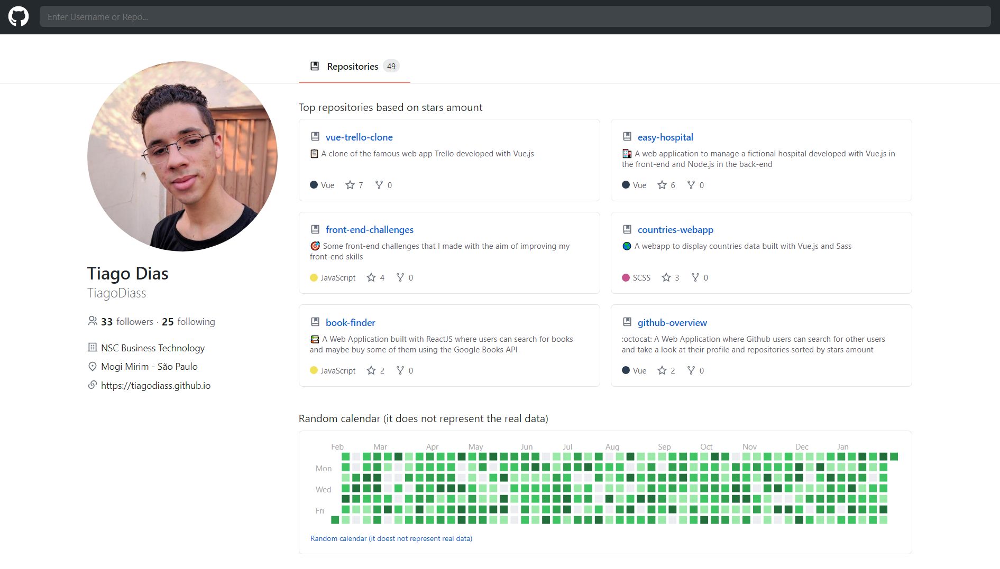

<h1 align="center">
  React Github UI Clone
</h1>

<h4 align="center">
  A functional clone of the user interface of the Github that can show the top 6 repositories of a user based on the stars amount of each repository, using the Github API.
</h4>

<p align="center">
  
  
</p>

<p align="center">
  <a href="#technologies">Used Technologies</a>&nbsp;&nbsp;&nbsp;|&nbsp;&nbsp;&nbsp;
  <a href="#objective">Project's goal</a>&nbsp;&nbsp;&nbsp;|&nbsp;&nbsp;&nbsp;
  <a href="#final-result">Final Result</a>&nbsp;&nbsp;&nbsp;|&nbsp;&nbsp;&nbsp;
  <a href="#how-to-use">How to Run</a>&nbsp;&nbsp;&nbsp;|&nbsp;&nbsp;&nbsp;
  <a href="#features">Features</a>
</p>

<h3 align="center">
  
</h3>

<p align="center">
  <a href="https://react-github-clone.netlify.app/" target="_blank">
    
  </a>
</p>

<h2 id="techonologies" name="technologies">
  :rocket: Used Technologies
</h2>

- [ReactJS with TypeScript](https://pt-br.reactjs.org/) to build the app in general
- [Styled Components](https://styled-components.com/) to style all the app(components, views and so on)
- [React Router](https://reactrouter.com/) to make multiple routes
- [Sweet Alert](https://sweetalert.js.org/) to make some toast messages
- [Axios](https://github.com/axios/axios) to make the all the requests to the API
- [Github REST API](https://docs.github.com/en/rest) to get all the data that the app uses

<h2 id="objective" name="objective">
  :dart: Project's goal
</h2>

The aim of this project was practicing React with TypeScript, two techs that I'm liking really much and working hard to improve in them.

<h2 id="final-result" name="final-result">
  :arrow_forward: Final Result
</h2>

### [You can check the final result clicking here](https://react-github-clone.netlify.app/)

<h2 id="features" name="features">
  :clipboard: Features
</h2>

- Dynamic fetching of a Github user using the Github REST API
- Dynamic sorting of the top 6 repositories of the user, this top 6 is based on the amount of stars of each repository
- Light and Dark theme
- Responsive design
- Loading animation and errors messages

<h2 id="how-to-use" name="how-to-use">
  :information_source: How to Run
</h2>

Follow the steps below to run the project in your machine, before it all, you need to have the Git, Node.js and Yarn installed on your computer, then follow the steps below:

```bash
# Clone the repo
$ git clone https://github.com/TiagoDiass/github-ui-clone.git

# Enter in the directory
$ cd github-ui-clone

# Install the dependencies
$ yarn install

# Start the app
$ yarn start
```

After following these steps, your browser will automatically open in `localhost:3000`. To stop the app just go back to the terminal and press <kbd>CTRL</kbd>+<kbd>C</kbd>.

---

Hope you enjoyed this project :smiley:<br>
:wave: [Get in touch!](https://www.linkedin.com/in/tiagodiass)

### Author: Tiago Dias
